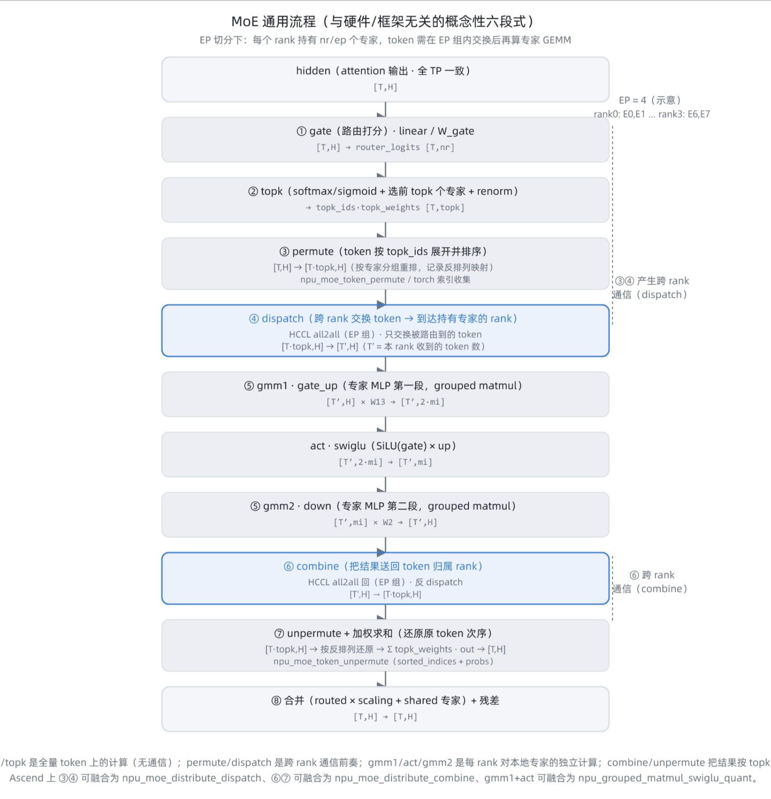
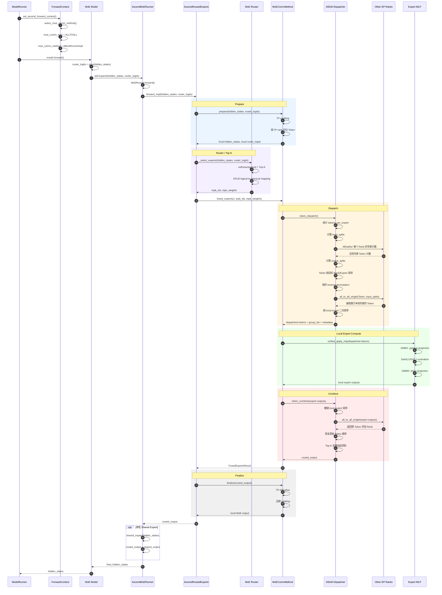
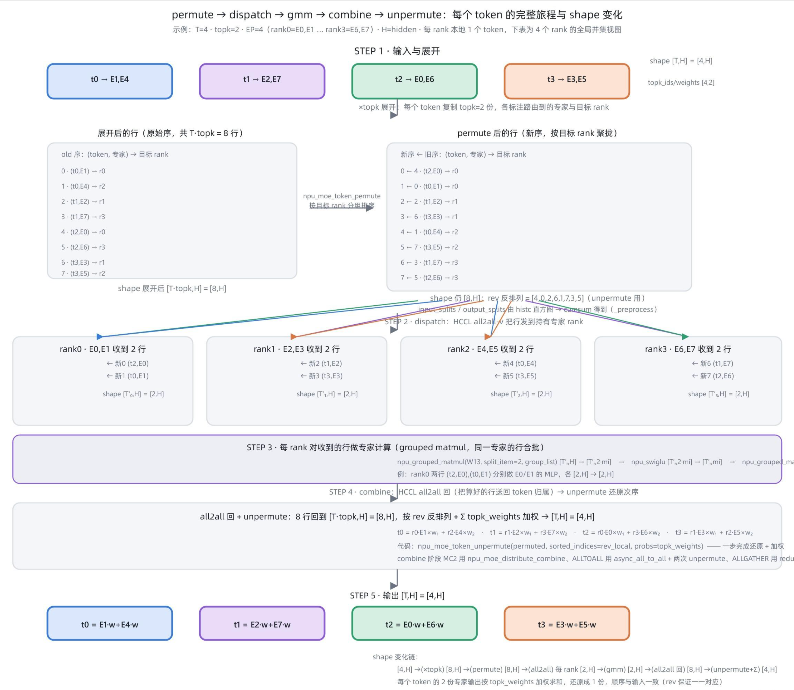
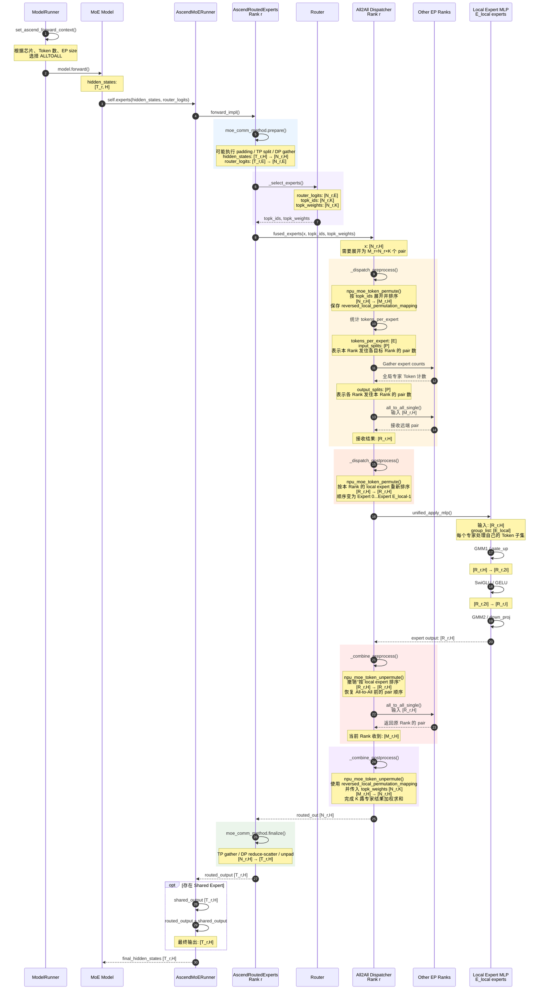
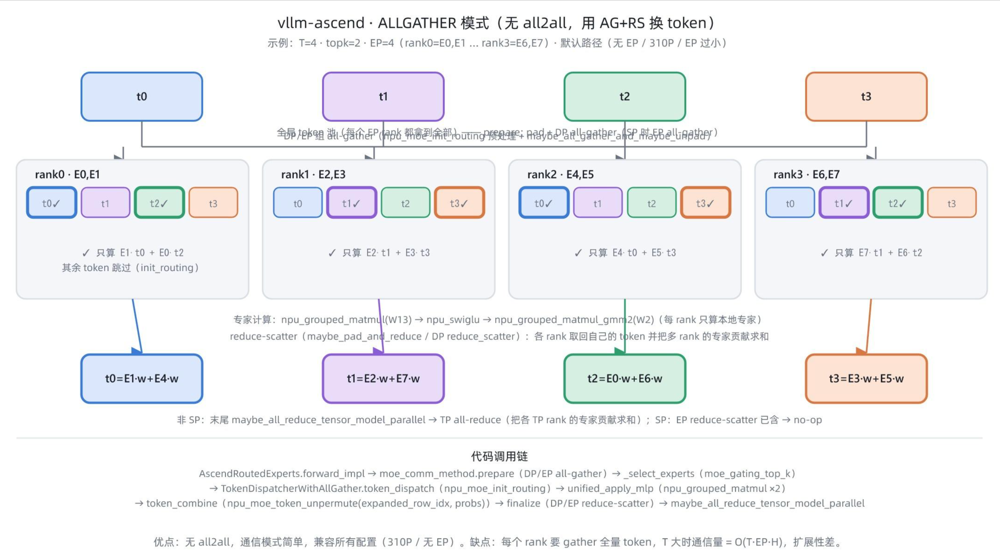
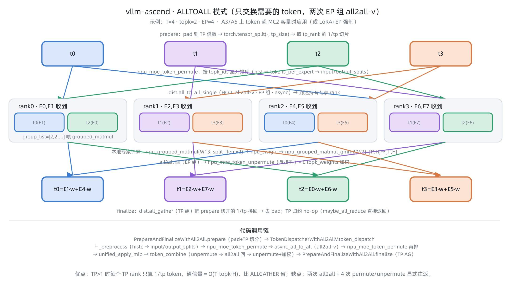
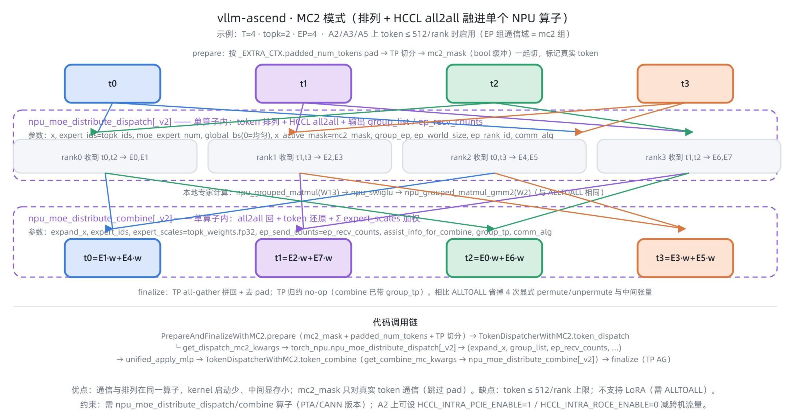

# vllm-ascend MoE 通信模式详解

### 1. MoE 通用流程

与硬件/框架无关的**概念性六段式**，**ALLTOALL**视角：



| 段 | 动作 | 输入 → 输出 | 是否跨 rank 通信 |
| --- | --- | --- | --- |
| ① gate | 路由打分 x·W_gate -> router_logits | [T,H] → [T,nr] | 否 |
| ② topk | softmax/sigmoid + 选前 topk 专家 + renorm | → topk_ids/weights [T,topk] | 否 |
| ③ permute | 按 topk_ids 展开并排序 token | [T,H] → [T·topk,H] | 否 |
| ④ dispatch | 把 token 发到持有对应专家的 rank | [T·topk,H] → [T′,H] | 是（HCCL all2all） |
| ⑤ gmm | 专家 MLP：gmm1(gate_up)+swiglu+gmm2(down) | [T′,H] → [T′,H] | 否（每 rank 只算本地专家） |
| ⑥ combine + unpermute | 结果送回归属 rank，按 topk 权重加权求和、还原次序 | [T′,H] → [T,H] | 是（all2all 回） |

要点：④ 与 ⑥ 是跨 rank 通信发生的两处；⑤ 是各 rank 对本地专家的独立计算。EP 切分下每个 rank 持有 `nr/ep` 个专家。

---



---

#### 1.1 逐步骤 token 追踪

以示例 `T=4 · topk=2 · EP=4` 展开 8 行，逐步骤看每个 token 的去向与 shape 变化：



**STEP 1 · 展开 + permute**（`npu_moe_token_permute`）

输入 `[4,H]`，每个 token 复制 `topk=2` 份，得到 8 行（每行标注「token, 专家 → 目标 rank」）。然后按**目标 rank** 分组重排，同时用`torch.histc(topk_ids)` 统计每个专家收到的行数，推导出 all2all 需要的 `input_splits / output_splits`：

```text
展开（原始序）                     permute 后（按目标 rank 聚拢）        rev 反排列
0 · (t0,E1)→r0                    0←4 · (t2,E0)→r0                      rev[0]=4
1 · (t0,E4)→r2                    1←0 · (t0,E1)→r0                      rev[1]=0
2 · (t1,E2)→r1                    2←2 · (t1,E2)→r1                      rev[2]=2
3 · (t1,E7)→r3                    3←6 · (t3,E3)→r1                      rev[3]=6
4 · (t2,E0)→r0                    4←1 · (t0,E4)→r2                      rev[4]=1
5 · (t2,E6)→r3                    5←7 · (t3,E5)→r2                      rev[5]=7
6 · (t3,E3)→r1                    6←3 · (t1,E7)→r3                      rev[6]=3
7 · (t3,E5)→r2                    7←5 · (t2,E6)→r3                      rev[7]=5
shape: [4,H] →×topk→ [8,H] →permute→ [8,H]
```

**STEP 2 · dispatch**（`dist.all_to_all_single`，HCCL all2all-v）

每个 rank 把路由到其他rank上专家的行发走、接收自己被路由到的行（本例每 rank 收 2 行）：

```text
rank0 收到 (t2,E0),(t0,E1)   → [T′₀,H]=[2,H]
rank1 收到 (t1,E2),(t3,E3)   → [T′₁,H]=[2,H]
rank2 收到 (t0,E4),(t3,E5)   → [T′₂,H]=[2,H]
rank3 收到 (t1,E7),(t2,E6)   → [T′₃,H]=[2,H]
```

**STEP 3 · gmm**（`npu_grouped_matmul` + `npu_swiglu` + `npu_grouped_matmul_gmm2`）

每 rank 对收到的行按 `group_list` 合批做本地专家 MLP：

```text
rank0: [2,H] ×W13 → [2,2·mi] →swiglu→ [2,mi] ×W2 → [2,H]
       同一专家的行（(t2,E0) 与 (t0,E1) 分属 E0/E1）在一个 grouped GEMM 里算
```

**STEP 4 · combine**（`npu_moe_token_unpermute` / `async_all_to_all`）

先撤销按local expert排序，把算好的行 all2all 回（每 rank 发回 `output_splits` 行），还原成 `[8,H]`。

**STEP 5 · unpermute + 加权**（`npu_moe_token_unpermute(sorted_indices=rev, probs=topk_weights)`）

按 `rev` 反排列恢复原始 token 次序，每个 token 的 2 份专家输出按 `topk_weights` 加权求和：

```text
t0 = E1·w + E4·w   t1 = E2·w + E7·w   t2 = E0·w + E6·w   t3 = E3·w + E5·w
shape: [8,H] →unpermute+Σ→ [4,H]
```

**shape 全链**：`[4,H] →(×topk) [8,H] →(permute) [8,H] →(all2all) 每rank [2,H] →(gmm) [2,H] →(all2all回) [8,H] →(unpermute+Σ) [4,H]`

> 四种模式在这里的差异：
>
> **ALLTOALL / MC2** 走上面的 permute→all2all→unpermute 双向交换；
>
> **ALLGATHER** 没有 permute/all2all，而是 prepare 阶段 all-gather 全量 token 后用 `npu_moe_init_routing` 直接得到排序结果，combine 用 reduce-scatter + 一步 `npu_moe_token_unpermute`；
>
> **FUSED_MC2** 把 STEP 1–5 全部收进 `mega_moe`/`dispatch_ffn_combine` 一个算子。

* * *

下面按普通ALLTOALL EP路径展开。假设：

```
H				= hidden size
E 			= 全局专家数
P 			= EP size
E_local = E / P
N_r 		= 当前 Rank 在 prepare 后处理的 Token 数
K 			= top-k
M_r 		= N_r × K，展开后的 token-expert pair 数
R_r 		= 当前 Rank 从所有 EP Rank 收到的 pair 数
```



---

### 2. ALLGATHER 模式

**通信语义**：不用 all2all，用 **all-gather + reduce-scatter** 换 token。每个 rank 先 gather 到全量 token（这样路由和专家计算覆盖整个 batch），算完自己的专家后 reduce-scatter 把各 rank 的贡献求和并归还每个 rank 的 token 份额。



核心逻辑：

```
本地 Token
→ AllGather
→ 每个 Rank 获得全局 Token
→ 本地专家计算
→ Unpermute + Top-K 聚合
→ ReduceScatter
```

代码调用链：

```text
AscendRoutedExperts.forward_impl
├─ moe_comm_method.prepare(...)
│    └─ PrepareAndFinalizeWithAllGather.prepare
│         ├─ 非 SP: _prepare_with_dp_group
│         │    ├─ DP>1: pad 到 max_tokens_across_dp → DP all-gather
│         │    └─ PCP>1: pad → PCP all-gather
│         └─ SP: _prepare_with_ep_group
│              ├─ maybe_all_gather_and_maybe_unpad    # EP all-gather，并按各 rank token 数去 pad
│              └─ PCP>1: pad → PCP all-gather
├─ _select_experts → router._select_experts           # 路由 topk
├─ quant_method.apply → moe_comm_method.fused_experts
│    ├─ TokenDispatcherWithAllGather.token_dispatch   # npu_moe_init_routing（token 计数/排序/反排列索引）
│    ├─ unified_apply_mlp                             # npu_grouped_matmul ×2 + npu_swiglu
│    └─ TokenDispatcherWithAllGather.token_combine    # npu_moe_token_unpermute(sorted_indices, probs) 一步还原+加权
└─ moe_comm_method.finalize
     └─ PrepareAndFinalizeWithAllGather.finalize
          ├─ 非 SP: _finalize_with_dp_group
          │    ├─ PCP>1: PCP reduce-scatter + 去 pad
          │    └─ DP>1: DP reduce-scatter + 去 pad
          └─ SP: _finalize_with_ep_group
               ├─ PCP>1: PCP reduce-scatter + 去 pad
               └─ maybe_pad_and_reduce                # EP reduce-scatter
AscendMoERunner._maybe_reduce_final_output
└─ 非 SP 且输出尚未归约: tensor_model_parallel_all_reduce
```

**示例走查**（t0 为例）：all-gather 后 4 个 rank 都有 t0–t3；`E1`在 rank0 上只算 `E1·t0` 、`E2` 在 rank1 算 `E2·t1`…；reduce-scatter 时 t0 的贡献（rank0 的 E1 + rank2 的 E4）求和后归还给 t0 的归属 rank0。

**优缺点**：实现最简单、兼容所有配置（无 EP / 310P / EP 过小）；但每个 rank 要 gather 全量 token，通信量 `O(T·EP·H)`，大 batch/EP 规模增大时通信和计算冗余会增加。

* * *

### 3. ALLTOALL 模式

**通信语义**：**只交换需要的 token**。每个 rank 先把 token 按专家排序（permute），用 **EP 组 HCCL all2all-v** 把 token 发给持有其 topk 专家的 rank；算完后 all2all 回，再 unpermute + 按 topk 权重加权求和。



核心逻辑

```
本地 Token
→ Permute
→ All-to-All-V
→ 按本地专家重新 Permute
→ Expert MLP
→ Unpermute
→ All-to-All-V
→ Unpermute + Top-K 加权
```

代码调用链

```text
AscendRoutedExperts.forward_impl
├─ moe_comm_method.prepare
│    └─ PrepareAndFinalizeWithAll2All.prepare         # pad → 按 token 维 TP 切分 → 取 tp_rank 切片
├─ _select_experts → router._select_experts           # 路由 topk
├─ quant_method.apply → MoECommMethod.fused_experts
│    ├─ TokenDispatcherWithAll2AllV.token_dispatch
│    │    ├─ _dispatch_preprocess
│    │    │    ├─ _preprocess: histc(topk_ids) → input_splits/output_splits
│    │    │    └─ npu_moe_token_permute(tokens, topk_ids)         # 第一次排列
│    │    ├─ [可选] npu_dynamic_quant
│    │    ├─ [量化时] async_all_to_all(dynamic_scale, output_splits, input_splits, ep_group)
│    │    ├─ async_all_to_all(tokens, output_splits, input_splits, ep_group)
│    │    │    └─ dist.all_to_all_single                         # dispatch all2all-v
│    │    └─ _dispatch_postprocess                               # 本地专家数>1时第二次排列
│    │         ├─ 量化: npu_moe_init_routing_v2
│    │         └─ 非量化: npu_moe_token_permute
│    ├─ unified_apply_mlp                                        # GMM1 → activation → GMM2
│    └─ TokenDispatcherWithAll2AllV.token_combine
│         ├─ _combine_preprocess: npu_moe_token_unpermute(rev_global)
│         ├─ async_all_to_all(tokens, input_splits, output_splits, ep_group)
│         │    └─ dist.all_to_all_single                         # combine all2all-v
│         └─ _combine_postprocess
│              └─ npu_moe_token_unpermute(rev_local, probs=topk_weights)
└─ moe_comm_method.finalize
     └─ PrepareAndFinalizeWithAll2All.finalize         # TP all-gather拼回 token 切片 → 去 pad
```

**示例走查**：`t0→E1(r0),E4(r2)`：t0 经 permute 排序后 all2all 到 rank0 和 rank2；rank0 用 E1 算 t0，rank2 用 E4 算 t0；all2all 回后按权重 `E1·w+E4·w` 求和还原成 t0。

**优缺点**：通信量 `O(T·topk·H)`，优于 ALLGATHER；代价是两次 all2all + 4 次显式 permute/unpermute 往返。

* * *

### 4. MC2 模式

**通信语义**：数据流与 ALLTOALL 相同，但「排列 + HCCL all2all」**融进单个 NPU 算子**（`npu_moe_distribute_dispatch` / `npu_moe_distribute_combine`），省掉显式 permute/unpermute 与中间张量；`mc2_mask`（bool 缓冲）只对真实 token 通信，跳过 pad 位置。

  



核心逻辑

```
输入准备
→ Router + TopK
→ npu_moe_distribute_dispatch
→ 本地 Expert MLP
→ npu_moe_distribute_combine
→ 输出恢复
```

代码调用链

```text
AscendRoutedExperts.forward_impl
├─ moe_comm_method.prepare
│    └─ PrepareAndFinalizeWithMC2.prepare
│         ├─ 按 _EXTRA_CTX.padded_num_tokens pad
│         ├─ hidden_states/router_logits 按 token 维 TP 切分
│         └─ mc2_mask 按相同方式切分
├─ _select_experts → router._select_experts
├─ quant_method.apply → MoECommMethod.fused_experts
│    ├─ TokenDispatcherWithMC2.token_dispatch
│    │    ├─ get_dispatch_mc2_kwargs
│    │    │    └─ global_bs=0 时才传 x_active_mask=mc2_mask
│    │    └─ npu_moe_distribute_dispatch[_v2]          # 排列 + dispatch all2all
│    │         → expand_x, dynamic_scale, assist_info_for_combine,
│    │           expert_token_nums, ep_recv_counts, tp_recv_counts, expand_scales
│    ├─ unified_apply_mlp                              # GMM1 → activation → GMM2
│    └─ TokenDispatcherWithMC2.token_combine
│         ├─ get_combine_mc_kwargs
│         └─ npu_moe_distribute_combine[_v2]           # combine all2all + 还原 + 加权
└─ moe_comm_method.finalize
     └─ PrepareAndFinalizeWithMC2.finalize              # 继承 All2All：TP all-gather → 去 pad
```

**示例走查**：与 ALLTOALL 完全相同的 token 走向（t0→r0,r2 …），区别是 8 条收发都在 `npu_moe_distribute_dispatch`  /  `npu_moe_distribute_combine` 两个算子内部完成。

**优缺点**：kernel 启动少、中间显存小、mask 裁剪；约束 token ≤ 512/rank，且不支持 LoRA（MC2融合算子无法打 LoRA 补丁 → 强制 ALLTOALL）。A2/A3/A5 上 token 数在容量内时优先选它。

* * *

### 5. FUSED\_MC2 模式

**通信语义**：FUSED_MC2 将通信、Permute、Expert MLP 和 Combine 尽量融合到**一个算子**中：CANN `mega_moe`（`cann_ops_transformer`）或 `torch.ops._C_ascend.dispatch_ffn_combine`，内部触发两次 HCCL all2all 并与 GMM 计算重叠。

核心逻辑：

```
Router + TopK
→ MegaMoe / dispatch_ffn_combine
├─ Dispatch
├─ EP 通信
├─ Expert GMM1
├─ Activation
├─ Expert GMM2
├─ Combine
└─ Top-K 聚合
→ routed output

A3 / MegaMoe 支持：
self.mega_moe(...)

旧版融合算子：
torch.ops._C_ascend.dispatch_ffn_combine(...)
```

代码调用链

```text
AscendRoutedExperts.forward_impl
├─ moe_comm_method.prepare
│    └─ PrepareAndFinalizeWithMC2.prepare              # pad + TP token 切分 + mc2_mask 切分
├─ _select_experts → router._select_experts
├─ quant_method.apply → FusedMC2CommImpl.fused_experts # 重载；不走独立 dispatcher/MLP/combine
│    ├─ _MEGA_MOE_SUPPORTED（可导入 cann_ops_transformer）
│    │    ├─ [首次] _init_mega_moe_symm_buffer
│    │    │    └─ get_symm_buffer_for_mega_moe(mc2_group, ...)
│    │    └─ mega_moe(
│    │         x, topk_ids.int32, topk_weights.fp32,
│    │         weight1_list, weight2_list, symm_buffer,
│    │         l1_weights_sf, l2_weights_sf, l1_bias, l2_bias,
│    │         x_active_mask, activation_clamp, weight1_type, weight2_type)
│    │         → out, expert_tokens
│    └─ 否则: torch.ops._C_ascend.dispatch_ffn_combine(
│              x, weight1, weight2, expert_idx=topk_ids,
│              scale1, scale2, bias1, bias2, probs=topk_weights.fp32,
│              group=mc2 HCCL comm name,
│              max_output_size=ascend_config.mega_moe_max_tokens,
│              swiglu_limit, x_active_mask=mc2_mask, out, expert_token_nums)
└─ moe_comm_method.finalize
     └─ PrepareAndFinalizeWithMC2.finalize              # TP all-gather → 去 pad
```

**约束**：`mega_moe` ep≤64、规划 token≤4096/rank；`dispatch_ffn_combine` ep≤32、规划 token≤512/rank；超出容量自动回退 MC2/ALLTOALL；权重必须 **FRACTAL_NZ**（加载后 `npu_format_cast`）。开启`mix_placement` 时共享专家也并入该算子。

**优缺点**：延迟/显存最低、通信与 GMM 重叠最好；但算子能力受 CANN/PTA 版本与规模限制，LoRA 场景不可用。

* * *

### 6\. 四模式对比

|   | ALLGATHER | ALLTOALL | MC2 | FUSED_MC2 |
| --- | --- | --- | --- | --- |
| 换 token 方式 | all-gather + reduce-scatter | EP 组 all2all-v ×2 | 融合 dispatch/combine 算子内完成 all2all | 融合专家算子内完成 all2all |
| dispatch 算子 | npu_moe_init_routing | npu_moe_token_permute + all_to_all_single | npu_moe_distribute_dispatch[_v2] | mega_moe / dispatch_ffn_combine |
| combine 算子 | npu_moe_token_unpermute（一步还原+加权） | unpermute + all2all 回 + unpermute/加权 | npu_moe_distribute_combine[_v2] | 同上（算子内部） |
| prepare | DP/EP all-gather | pad + TP token 切分 | pad + TP token 切分 + mc2_mask | 同 MC2 |
| finalize | reduce-scatter + TP all-reduce | TP all-gather | TP all-gather | TP all-gather |
| 通信量 | O(T·EP·H) | O(T·topk·H) | 同 ALLTOALL（省中间张量） | 同 MC2（更省） |
| 规划 token 容量 | 无 | 无（超 MC2 容量用） | ≤512/rank | ≤512（ffn_combine）/4096（mega_moe）/rank |
| 适用 | 无 EP / 310P / 小 EP | LoRA+EP / A3·A5 大 batch | A2·A3·A5 小 batch | A3 + enable_fused_mc2 |

**运行时自动选择**（`ascend_forward_context.py::select_moe_comm_method`）：

- 非 MoE 返回 `None`；
- MoE 无有效 EP 或运行在 310P 时使用 ALLGATHER；
- LoRA+EP 使用 ALLTOALL。
- A2 在每设备专家数≤24、EP world size≥16 且 token 数不超过 MC2 容量时使用 MC2，否则使用 ALLGATHER。
- A3 在启用 fused 且 EP≤64（`mega_moe`）或 EP≤32（`dispatch_ffn_combine`）时使用 FUSED_MC2，否则在容量内使用 MC2、超出容量使用 ALLTOALL。
- A5 在容量内且 world size>1 时使用 MC2；其余情况下根据 world size 与每 token 专家数的关系选择 ALLGATHER 或 ALLTOALL。

### 7. 参考

https://zhuanlan.zhihu.com/p/2070900165767066093
